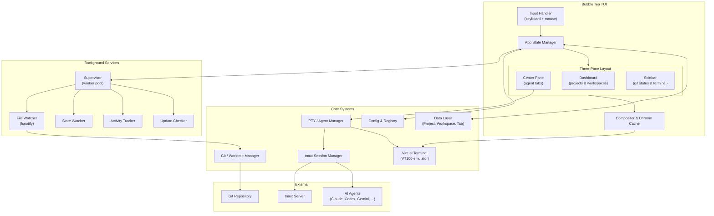

<p align="center">
  
</p>

<p align="center">TUI for running parallel coding agents</p>


---


## What is tumuxi?

tumuxi is a TUI for running multiple coding agents in parallel. Each agent works in isolation on its own git worktree branch, so you can merge changes back when done.

## Prerequisites

tumuxi requires [tmux](https://github.com/tmux/tmux) (minimum 3.2). Each agent runs in its own tmux session for terminal isolation and persistence.

## Quick start

Via the install script:

```bash
curl -fsSL https://raw.githubusercontent.com/tlepoid/tumuxi/main/install.sh | sh
```

Or with Go:

```bash
go install github.com/tlepoid/tumuxi/cmd/tumuxi@latest
```

## Features

- **Parallel agents**: Launch multiple agents within main repo and within workspaces
- **No wrappers**: Works with Claude Code, Codex, Gemini, Amp, OpenCode, and Droid
- **Keyboard + mouse**: Can be operated with just the keyboard or with a mouse
- **All-in-one tool**: Run agents, view diffs via lazygit, and access terminal
- **Integrate with GitHub**: Syncs with github to autopopulate agents with context from issues

## Architecture


